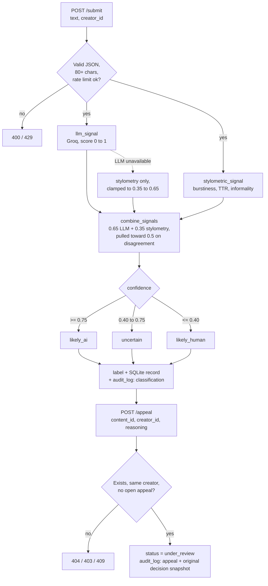

# Provenance Guard

A Flask backend that classifies submitted writing as likely AI, likely human, or uncertain, with a confidence score, a plain-language label, and an appeals workflow.

Built for CodePath AI201 (project 4), 2026.
Stack: Flask, Groq (llama-3.3-70b-versatile), pure-Python stylometrics, Flask-Limiter, SQLite.
The pre-implementation spec is in [planning.md](planning.md).

## How it works



## Example

Real output recorded during the project's manual testing (details under [Validation](#validation-real-scores-from-testing)):

| Input | LLM | Stylometric | Confidence | Attribution |
|---|---|---|---|---|
| Template AI prose | 0.9 | 0.5829 | 0.789 | likely_ai |
| Lightly humanized wellness paragraph | 0.6 | 0.7165 | 0.6408 | uncertain |
| Casual first-person restaurant rant | 0.2 | 0.1502 | 0.1826 | likely_human |

## Run locally

```bash
git clone https://github.com/Ned-Ibrahim/provenance-guard.git
cd provenance-guard
python3 -m venv .venv
source .venv/bin/activate
pip install -r requirements.txt
export GROQ_API_KEY=...   # or put GROQ_API_KEY in a .env file
python app.py             # http://localhost:5001
```

The only environment variable is `GROQ_API_KEY`.
Without it the LLM signal reports as unavailable and the system falls back to a hedged stylometry-only score.

## Tests

There is no automated test suite yet.
Verification so far was manual (curl against every error path, an appeal round trip, and a rate-limit run), documented below.
For that reason there is no CI workflow.

## Demo UI

Open http://localhost:5001/ in a browser for a small demo interface on top of the API.
It submits text, renders the verdict with the confidence value plotted against the 0.40 and 0.75 threshold bands, shows both signal scores with the stylometric sub-metrics, lets the creator file an appeal, and displays the live audit log.
The API itself is unchanged; the page is a thin client over `/submit`, `/appeal`, and `/log`.

## API

| Endpoint | Body | Returns |
|---|---|---|
| `POST /submit` | `{text, creator_id}` | `{content_id, attribution, confidence, signals, label, status}` |
| `POST /appeal` | `{content_id, creator_id, creator_reasoning}` | `{content_id, status: "under_review", message}` |
| `GET /log?limit=N` | (none) | most recent audit log entries, newest first |
| `GET /content/<id>` | (none) | full stored record for one submission |

Submissions under 80 characters are rejected with a 400, because the stylometric metrics are statistically meaningless on tiny samples.

## Architecture Overview

The path a submission takes from input to transparency label:

1. `POST /submit` receives `{text, creator_id}` and passes validation (JSON shape, required fields, 80-character minimum) and the rate limiter.
2. The text fans out to two independent signals in `signals.py`: `llm_signal` sends it to Groq and parses a 0 to 1 AI-likelihood plus a one-sentence rationale, while `stylometric_signal` computes three pure-Python surface metrics and averages them into its own 0 to 1 score.
3. `scoring.py` combines the two scores with a 0.65/0.35 weighted blend, then pulls the result toward 0.5 whenever the signals strongly disagree, producing the final confidence.
4. The confidence selects an attribution bucket (`likely_ai`, `uncertain`, `likely_human`) through asymmetric thresholds, and the bucket selects the exact label text a reader would see.
5. `storage.py` persists the full decision to SQLite: the `contents` table holds current state per submission, and the append-only `audit_log` table records the classification event with both individual signal scores.
6. The response returns the content ID, attribution, confidence, both signal breakdowns, and the label text.

The appeal path: `POST /appeal` validates that the content exists, that the appellant is the original submitter, and that no appeal is already open; it then flips the content status to `under_review` and appends an appeal event to the audit log carrying the creator's reasoning next to a snapshot of the original decision.

The full diagram lives in [planning.md](planning.md#architecture).

## Detection Signals

### Signal 1: LLM classification (Groq, llama-3.3-70b-versatile)

**What it measures:** a whole-passage, semantics-aware judgment of whether the text reads as AI-generated: stock transitions, hedged both-sides framing, uniform rhythm, absence of lived specificity.
The prompt explicitly instructs the model that formal register alone is not proof of AI, to reduce bias against academic and non-native writers.
It runs at temperature 0 with JSON-mode output and returns a 0 to 1 score plus a one-sentence rationale that is stored for reviewers.

**Why chosen:** an LLM can recognize distributional patterns of AI prose that no hand-written heuristic can enumerate, and the rationale gives human reviewers something interpretable during appeals.

**What it misses:** it judges style, not provenance.
Formal-but-human prose looks AI-ish to it, lightly humanized AI output can fool it, and it can fail entirely (network, API), so the pipeline degrades gracefully: when the LLM signal is unavailable, confidence is computed from stylometrics alone but hard-clamped into the uncertain band [0.35, 0.65] and the log records `degraded: true`.

### Signal 2: Stylometric heuristics (pure Python)

**What it measures:** three surface statistics, each normalized so 1.0 reads as AI-like, then averaged:

- Burstiness: coefficient of variation of sentence lengths. Humans mix short and long sentences; AI output is metronomic.
- Type-token ratio: vocabulary diversity over the first 200 words, mapped so a clean mid-high band reads AI-like while heavy repetition or very rich vocabulary reads human.
- Informality: density of informal markers per 100 words (contractions, ellipses, interrobangs, shouting caps, lowercase sentence starts, interjections). AI defaults to clean standard punctuation.

**Why chosen:** it is genuinely independent of the LLM signal (structural rather than semantic), costs nothing, cannot go down, and its three sub-metrics are individually logged so a surprising verdict can be traced to the specific metric that drove it.

**What it misses:** surface texture only.
Polished professional human prose scores AI-like, and constrained forms like minimalist poetry break the burstiness assumption.
This is why it gets the minority weight and why disagreement with the LLM pushes the verdict toward uncertain rather than letting either signal win.

## Confidence Scoring

The combined score answers "how likely is it that this text is AI-generated?" on a 0 to 1 scale, where 0.5 means the evidence is genuinely balanced.

```
raw = 0.65 * llm_score + 0.35 * stylo_score
disagreement = abs(llm_score - stylo_score)
if disagreement > 0.35:
    confidence = raw + (0.5 - raw) * min(1.0, (disagreement - 0.35) / 0.45)
```

Two design decisions matter here:

1. **Disagreement damping.** When the signals diverge by more than 0.35, the score is pulled proportionally toward 0.5. Two conflicting signals must never produce a confident verdict, which is what makes a 0.95 mean something: it requires both signals independently near-certain.
2. **Asymmetric thresholds.** `likely_ai` requires confidence >= 0.75 while `likely_human` requires only <= 0.40, with everything between labeled uncertain. The band is deliberately not centered on 0.5: on a writing platform, falsely accusing a human writer is worse than missing an AI submission, so the system demands more evidence to accuse than to clear.

### Validation: real scores from testing

Tested with four deliberately chosen inputs spanning the range (see planning.md section 2 for the method).
Two examples showing the scoring produces meaningful variation, not a constant:

**High-confidence case** (template AI prose: "Artificial intelligence represents a transformative paradigm shift... It is important to note that... Furthermore, stakeholders..."):

```json
"attribution": "likely_ai",
"confidence": 0.789,
"signals": {
  "llm": {"score": 0.9, "rationale": "The passage exhibits a high likelihood of being AI-generated due to its use of stock transitions, hedged both-sides framing, and generic vocabulary."},
  "stylometric": {"score": 0.5829, "metrics": {"burstiness": 0.5161, "ttr": 0.2326, "informality": 1.0}}
}
```

**Lower-confidence case** (lightly humanized AI-style wellness paragraph mixing "In my experience..." with "Research consistently shows..."):

```json
"attribution": "uncertain",
"confidence": 0.6408,
"signals": {
  "llm": {"score": 0.6},
  "stylometric": {"score": 0.7165, "metrics": {"burstiness": 1.0, "ttr": 0.1494, "informality": 1.0}}
}
```

For contrast, a casual first-person restaurant rant scored **0.1826 (likely_human)** with both signals agreeing low (LLM 0.2, stylometric 0.1502).
The full spread across the four test inputs was 0.18 to 0.79, all three attribution buckets were reached, and the borderline inputs landed in or near the uncertain band as designed.

## Transparency Label

The exact text shown to a reader, one variant per attribution bucket.
The label is returned by `/submit` and stored with each decision.

| Variant | Trigger | Exact label text |
|---|---|---|
| High-confidence AI | confidence >= 0.75 | **Likely AI-generated.** Our automated analysis found strong signs that this piece was written by an AI tool rather than a person. This is an automated assessment and can be wrong. If you are the creator and you wrote this yourself, you can appeal this label and a person will review it. |
| Uncertain | 0.40 < confidence < 0.75 | **Origin unclear.** Our automated analysis couldn't confidently determine whether this piece was written by a person or by an AI tool. Some signals point each way. Please read with your own judgment: this label reflects genuine uncertainty, not an accusation. |
| High-confidence human | confidence <= 0.40 | **Likely human-written.** Our automated analysis found strong signs that this piece was written by a person. No automated check is perfect, but nothing here suggests AI generation. |

The asymmetry is deliberate: the AI label leads with "automated," admits it can be wrong, and names the appeal path inside the label itself; the uncertain label explicitly disclaims accusation; the human label carries no appeal language because nobody appeals being called human.
All three variants were verified reachable with live submissions (scores 0.789, 0.6408, and 0.1826 above).

## Appeals Workflow

A creator contests a classification by calling `POST /appeal` with the `content_id`, their `creator_id`, and free-text `creator_reasoning`.
The endpoint validates ownership (403 if the creator does not match), existence (404), and duplicates (409 if an appeal is already open), then flips the content status from `classified` to `under_review` and logs an appeal event.
The appeal log entry deliberately carries a snapshot of the original decision (attribution, confidence, both signal scores, label) next to the creator's own words, so a human reviewer opening the queue sees the whole case in one entry, including which signal drove the verdict.

Live example: the formal economics paragraph (a human-plausible text) classified as `likely_ai` at 0.752, and the creator appealed:

```json
{
  "content_id": "b9d8b03b-e4ae-4b5d-8151-934ae940554e",
  "status": "under_review",
  "message": "Appeal received. Your content is now marked as under review and a human reviewer will see your reasoning alongside the original automated decision."
}
```

Automated re-classification is intentionally out of scope; the appeal queue is for humans.

## Rate Limiting

Implemented with Flask-Limiter (in-memory storage, keyed per client IP).

| Endpoint | Limit | Reasoning |
|---|---|---|
| `POST /submit` | 10/minute and 100/day | A real writer submits finished pieces, a handful per day at most. 10/minute leaves room for a workshop session or quick resubmission after edits, while making adversarial probing (tuning text against the detector by rapid trial) slow and expensive. 100/day caps sustained scripted abuse without ever touching a legitimate creator. |
| `POST /appeal` | 5/minute and 20/day | Appeals are rarer than submissions and each one creates human review work, so flooding the review queue is the attack that matters here. |
| `GET /log`, `GET /content` | none | Read-only, exposed for grading and demo visibility; in production these would sit behind reviewer auth instead. |

Verified live with 12 rapid requests against a fresh server:

```
request 1: 200   ...   request 10: 200
request 11: 429
request 12: 429
```

The 429 body is structured JSON: `{"error": "rate limit exceeded", "detail": "10 per 1 minute"}`.

## Audit Log

Every decision and appeal is appended to the `audit_log` table in SQLite and exposed via `GET /log`.
Classification entries record timestamp, content ID, creator, attribution, combined confidence, both individual signal scores, the stylometric sub-metrics, the label shown, and whether the pipeline was degraded.
Appeal entries add the creator's reasoning plus the original decision snapshot.

Sample from `GET /log` (one appeal and two classifications; the log contains five entries from the demo run):

```json
{
  "entries": [
    {
      "id": 5,
      "event": "appeal",
      "content_id": "b9d8b03b-e4ae-4b5d-8151-934ae940554e",
      "creator_id": "demo-econ-writer",
      "creator_reasoning": "I wrote this myself from personal experience. I am a non-native English speaker and my writing style may appear more formal than typical.",
      "original_decision": {
        "attribution": "likely_ai",
        "confidence": 0.752,
        "llm_score": 0.8,
        "stylo_score": 0.6628,
        "label": "**Likely AI-generated.** Our automated analysis found strong signs that this piece was written by an AI tool rather than a person. This is an automated assessment and can be wrong. If you are the creator and you wrote this yourself, you can appeal this label and a person will review it."
      },
      "status": "under_review",
      "timestamp": "2026-07-13T03:31:12Z"
    },
    {
      "id": 4,
      "event": "classification",
      "content_id": "b9d8b03b-e4ae-4b5d-8151-934ae940554e",
      "creator_id": "demo-econ-writer",
      "attribution": "likely_ai",
      "confidence": 0.752,
      "llm_score": 0.8,
      "llm_ok": true,
      "stylo_score": 0.6628,
      "stylo_metrics": {"burstiness": 0.6742, "ttr": 0.3142, "informality": 1.0},
      "degraded": false,
      "status": "classified",
      "timestamp": "2026-07-13T03:31:12Z"
    },
    {
      "id": 3,
      "event": "classification",
      "content_id": "745b1cca-5fcf-48d2-8691-c25202107b97",
      "creator_id": "demo-wellness-writer",
      "attribution": "uncertain",
      "confidence": 0.6408,
      "llm_score": 0.6,
      "llm_ok": true,
      "stylo_score": 0.7165,
      "stylo_metrics": {"burstiness": 1.0, "ttr": 0.1494, "informality": 1.0},
      "degraded": false,
      "status": "classified",
      "timestamp": "2026-07-13T03:31:12Z"
    }
  ]
}
```

## Known Limitations

**Formal prose by non-native English speakers is the system's most likely unfair false positive, and the mechanism is specific.**
Writers taught formal register produce balanced, hedged, cleanly punctuated prose.
That hits the LLM signal (formal tone, generic vocabulary, low personal specificity) and the stylometric signal (informality metric reads clean punctuation as AI-like) at the same time, and because both signals agree, disagreement damping cannot rescue the score.
This happened live in testing: a human-plausible economics paragraph scored 0.752 and crossed the `likely_ai` threshold by 0.002.
The 0.75 accusation bar exists mostly to protect this population, but it is a mitigation, not a fix; the honest answer is the appeal path, which is exactly the scenario the demo appeal exercises.

Related failure modes, tied to the same signal properties: minimalist or repetitive poetry breaks the burstiness assumption (uniform short lines read as metronomic), and human-edited AI drafts have genuinely mixed provenance the system cannot decompose, so the best it can honestly do is land them in the uncertain band.

## Spec Reflection

**How the spec helped:** writing the exact combination formula, thresholds, and all three label texts in planning.md before any code meant the generated implementation could be verified mechanically instead of judged by vibes.
When reviewing the AI-generated scoring module, the check was a constant-by-constant diff against the spec (0.65/0.35 weights, 0.35 disagreement trigger, 0.75/0.40 thresholds, label strings verbatim), which caught nothing precisely because there was nothing ambiguous for the generator to improvise.

**Where implementation diverged:** the spec's stylometric informality metric counted any ALL CAPS word of length >= 2 as an informal marker.
Testing the pipeline on the curated inputs exposed the flaw: the acronym "AI" in the clearly-AI test text was counted as shouting, which dragged the stylometric score down, triggered disagreement damping against a 0.9 LLM score, and landed an obviously AI text in the uncertain band at 0.64.
The implementation now requires length >= 3 so common acronyms (AI, US, UK) do not count, and the same text correctly scores 0.789 likely_ai.
The lesson recorded for next time: any text-statistics spec should be sanity-checked against the domain's own vocabulary, because a detector of AI content will constantly see the word "AI."

## AI Usage

1. **Directed an AI tool to generate `signals.py` and `scoring.py` from the spec.** I provided the detection signals and uncertainty representation sections of planning.md plus exact function signatures, and required that no constant, threshold, or label string be changed. The output was correct against a line-by-line spec check (weights, damping formula, thresholds, and all three label texts matched verbatim), so the main revision was behavioral rather than textual: my own testing revealed the ALL CAPS acronym flaw described above, and I overrode the generated regex from `[A-Z]{2,}` to `[A-Z]{3,}` after tracing the uncertain misclassification to the informality sub-metric in the logged breakdown.
2. **Directed an AI tool to generate `app.py` and `storage.py` against a frozen interface contract.** Because the four modules were generated in parallel, I gave this generation the exact signatures of `llm_signal`, `stylometric_signal`, `combine_signals`, `attribution_for`, and `label_for` as assumptions rather than letting it invent them, plus the full endpoint behavior spec (status codes 400/403/404/409, appeal snapshot logging, limiter configuration with `storage_uri="memory://"`). The generated code matched the contract and ran against the separately generated modules without modification; verification was end-to-end rather than by reading alone: live curl tests of every error path, the appeal round-trip, and the 12-request rate-limit run documented above.

## Project Structure

```
app.py          Flask routes, validation, rate limiting, response assembly
signals.py      llm_signal (Groq) and stylometric_signal (pure Python)
scoring.py      signal fusion, thresholds, label text
storage.py      SQLite persistence: contents table + append-only audit_log
planning.md     pre-implementation spec and architecture diagram
```

## License

MIT. See [LICENSE](LICENSE).
